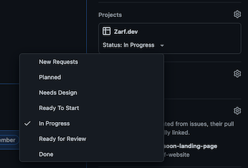

  

<h1 align="center">
  Zarf Website Contributors Guide
</h1>

## Currently Maintained by [Defense Unicorns](https://defenseunicorns.com)

## 👀 Looking for Zarf?

- [Zarf Website](https://zarf.dev)
- [Zarf Repo](https://github.com/defenseunicorns/Zarf)

## 📚 Resources

- [Staging](https://defenseunicorns.github.io/zarf-website-staging/)
- [Project Board](https://github.com/orgs/defenseunicorns/projects/4)
- [Figma Design](https://www.figma.com/file/FVxDm72mPiUTKmAD44ixmX/MUI-for-Figma-v5.4.0---Material-UI?node-id=8763%3A73842)
- [Forking](./docs/forking.md)
- [Gatsby](./docs/gatsby.md)
- [Material UI](https://v4.mui.com/getting-started/installation/)
- [Material UI System](https://mui.com/system/basics/)

---

## 👩‍🎨 Design Contacts

- [Madeline Fortner](https://github.com/Madeline-UX)

## 👩‍💻 Developer Contacts

- [Mike Winberry](https://github.com/mike-winberry)

---

## 🚀 Start Developing.

### 📝 Notes

- **_All commits must be [signed](https://docs.github.com/en/authentication/managing-commit-signature-verification/signing-commits)._**
- **_All components should use [Material UI (emotion)](https://v4.mui.com/getting-started/installation/) or [Material UI System (emotion)](https://mui.com/system/basics/)_**
- **_All UI issues expect responsiveness to be completed (no mobile/desktop story separation)_**

### 🚜 Set up Dev Environment

1. Install [Node.js LTS](https://nodejs.org/en/download/) or use [nvm](https://github.com/nvm-sh/nvm)
2. [Clone](https://github.com/defenseunicorns/zarf-website) (🦄 Unicorns) or [Fork](docs/forking.md) (🐙 Contributors)
3. Install dependencies w/ `npm ci`
4. Run the local dev server w/ `npm run develop`

### ⛏ Picking an Issue

1. Go to [Ready To Start](https://github.com/orgs/defenseunicorns/projects/4/views/4) or [Project Board](https://github.com/orgs/defenseunicorns/projects/4/views/1) and 👀 @ Ready To Start Column.
2. Choose an issue that has not yet been assigned.
   - Good first issues will be labeled.
3. [Assign yourself](https://docs.github.com/en/issues/tracking-your-work-with-issues/assigning-issues-and-pull-requests-to-other-github-users)

4. Move issue to In Progress

    

5. [Create a branch for issue](https://docs.github.com/en/issues/tracking-your-work-with-issues/creating-a-branch-for-an-issue)

### 🖐 Pull Request

1. After creating an issue. Create a [Draft](https://github.blog/2019-02-14-introducing-draft-pull-requests/) pull request for that issues branch.
   - There are two branches that pull requests should be merged to.
   - The issues will be labeled with the branch name
     1. Develop
     2. Main
2. Once ready for merge, move issue into "Ready For Review Column" and [request a review](https://docs.github.com/en/pull-requests/collaborating-with-pull-requests/proposing-changes-to-your-work-with-pull-requests/requesting-a-pull-request-review) from [CODEOWNERS](./CODEOWNERS)
   - Ensure all pipelines are green.
   - Ensure issue branch is up to date with branch to merge to.
   - All conversations must be resolved.
   - Reviewer will merge if Approved.
