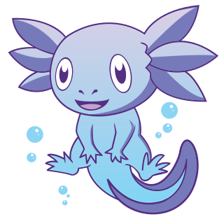

  

<h1 align="center">
  Forking Guide
</h1>

The zarf website was intentionally set up to allow for contributors and other users to easily fork and setup their own working environment within their own account or organization. [How to fork a repo.](https://docs.github.com/en/get-started/quickstart/fork-a-repo)
### 🪜 Steps
- Fork the zarf-website repository.
- Add the required [secrets](#secrets). 
- Enable actions on the forked repository. 
  - This is required to pass PR checks when opening a PR against the base repo from a forked branch. 
### 📝 **Note**:
***If the [ACCESS_TOKEN](#accesstoken-required) is not set on forked repository the required checks for merging a PR will not pass.  Alternatively a contributer can use the [projects board](https://github.com/orgs/defenseunicorns/projects/4/views/1) to [create a branch for issue](https://docs.github.com/en/issues/tracking-your-work-with-issues/creating-a-branch-for-an-issue) and then merge from the forked repository to this branch prior to creating a pull request against the main or develop branch.***
## 🕵️‍♀️ Secrets
In order to run the github actions for the Zarf website a repo owner will need to add 1-2 secrets to the forked repo. [Adding a secret.](https://docs.github.com/en/actions/security-guides/encrypted-secrets)   
- ### ACCESS_TOKEN (required)
  - [Creating access token.](https://docs.github.com/en/authentication/keeping-your-account-and-data-secure/creating-a-personal-access-token)
  - This ghp token can be created by an owner or collaborator
  - Must have permission to 
    - create repo
    - delete repo
    - push to repo
- ### ORG (optional for non-organizational repositories)
  - The name of the organization that will own the repo. 
  - Used to ensure pr-staging, development, and production repositories are created in the correct place. 
  - If the repo does not exist within an organization this should be left undefined. 

